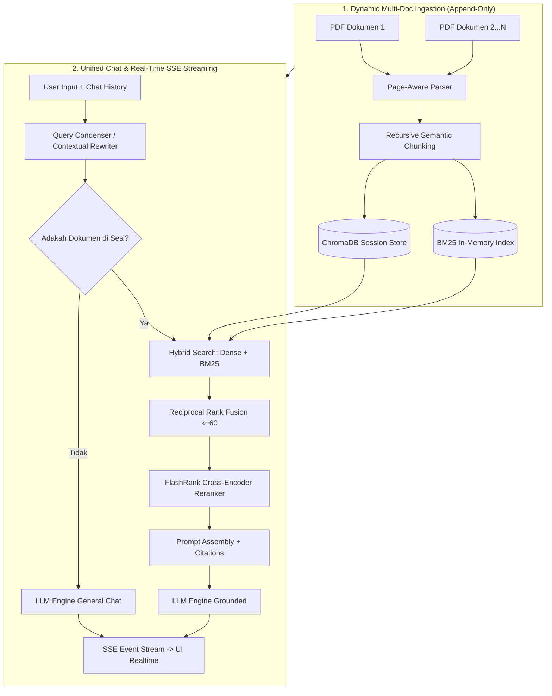

# Spesifikasi Arsitektur Conversational RAG: Unified Multi-Document Accumulation

Dokumen ini berisi spesifikasi arsitektur RAG (*Retrieval-Augmented Generation*) terpadu untuk `airesume-project`. Arsitektur ini dirancang agar percakapan terasa alami dan mengalir seperti ChatGPT, dengan kemampuan **penambahan dokumen bertahap di tengah percakapan (Incremental Multi-Doc Accumulation)** tanpa memutus alur chat.

---

## 1. Konsep Utama: Unified Session & Auto-RAG Detection

Membuang pemisahan kaku antara Mode Chat Biasa (`/chat`) dan Mode RAG (`/analyze`).

```
                              ┌──────────────────────────────────────────────┐
                              │ Input User / Upload PDF di Pertengahan Chat  │
                              └──────────────────────┬───────────────────────┘
                                                     │
                                                     ▼
                                      ┌──────────────────────────────┐
                                      │  Unified Endpoint: /chat     │
                                      └──────────────┬───────────────┘
                                                     │
                                  Apakah Sesi Punya Dokumen Terunggah?
                                      ┌──────────────┴──────────────┐
                                      │                             │
                                  [ BELUM ]                      [ SUDAH ]
                                      │                             │
                                      ▼                             ▼
                            ┌───────────────────┐     ┌────────────────────────────┐
                            │ General Chat Flow │     │ Auto Hybrid RAG Pipeline   │
                            │ (Riwayat Chat)    │     │ (Multi-Doc + Citations)    │
                            └───────────────────┘     └────────────────────────────┘
```

### Skenario Alur Pengguna (User Journey):
1. **Awal Percakapan**: User membuka sesi baru dan menyapa/tanya umum (Chat biasa berjalan lancar).
2. **Upload Dokumen Pertama**: User mengunggah `resume_v1.pdf`. Backend melakukan *ingestion* ke `session_id`. Sesi otomatis mengaktifkan mode Auto-RAG.
3. **Percakapan Berlanjut**: User bertanya tentang `resume_v1.pdf`. Jawaban diberikan dengan rujukan sitasi halaman.
4. **Upload Dokumen Kedua (Ekspansi Pengetahuan)**: User mengunggah `portofolio.pdf` di tengah percakapan. Dokumen kedua ditambahkan (*append*) ke memori sesi tanpa mereset riwayat chat atau menghapus `resume_v1.pdf`.
5. **Jawaban Akumulasi**: User bertanya lintas dokumen (*"Bandingkan skill di resume dengan proyek di portofolio"*). RAG mencari ke seluruh dokumen terakumulasi dan menjawab secara utuh.

---

## 2. Diagram Pipeline Arsitektur



---

## 3. Komponen Spesifikasi Teknis

### A. Incremental Multi-Doc Store
- **ChromaDB**: Koleksi `session-{session_id}` menyimpan chunk dari semua file terunggah di sesi tersebut dengan metadata:
  ```json
  {
    "source": "portofolio.pdf",
    "page": 2,
    "chunk_id": "portofolio.pdf-p2-c3-a1b2c3"
  }
  ```
- **BM25 In-Memory Hydration**: `_ensure_bm25_store` menjamin indeks BM25 di RAM selalu sinkron dan ter-update secara *incremental*, serta otomatis me-rebuild dari ChromaDB jika backend di-restart.

### B. Multi-turn Query Condensation
- Untuk pertanyaan ambigu / konteks berlanjut (misal: *"Berapa nilainya?"* setelah bertanya *"Sebutkan IPK di resume"*), Query Condenser mengubah input menjadi query eksplisit sebelum dikirim ke RAG pipeline:
  - *Raw User Input*: *"Berapa nilainya?"*
  - *Condensed Query*: *"Berapa IPK Ahmad pada resume yang diunggah?"*

### C. Hybrid Search & Cross-Encoder Reranking
- **Dense Vector**: Cosine similarity pada ChromaDB.
- **Sparse Vector**: `BM25Okapi` kata kunci eksplisit (nama, tanggal, IPK, angka, nama teknologi).
- **Rank Fusion**: $RRF\_Score(d) = \frac{1}{60 + rank_{dense}(d)} + \frac{1}{60 + rank_{sparse}(d)}$.
- **CPU Reranker**: `flashrank` dengan model `ms-marco-TinyBERT-L-2-v2` via ONNX runtime.

### D. SSE Streaming Response (ChatGPT-Like Flow)
- Jawaban dikirim menggunakan **Server-Sent Events (SSE)** via endpoint `/chat/stream`.
- *Time to First Token (TTFT)* < 300ms, memberikan pengalaman membaca yang mengalir tanpa *wait-and-load* kaku.

---

## 4. Matriks Perubahan Alur Sistem

| Fitur | Spesifikasi Lama | Spesifikasi Baru (Unified Flow) |
| :--- | :--- | :--- |
| **Endpoint API** | Terpisah (`/chat` vs `/analyze`) | **Tunggal (`/chat` & `/chat/stream`)** |
| **Upload Dokumen** | Di awal sesi saja (Overwrites) | **Kapan saja di tengah sesi (Appends)** |
| **Penyimpanan Dokumen** | Single File | **Multi-Document Accumulation** |
| **Persepsi Kecepatan** | Response JSON Blocking (Lag) | **Real-Time Streaming SSE (Mengalir)** |
| **Konteks Pertanyaan** | Single Turn | **Multi-Turn Query Rewriting** |

---

## 5. Roadmap Eksekusi Pembaruan Projek

1. **Phase 2A: RAG Core Engine Refactoring** (✅ Backend Complete)
   - Integrated `pypdf` page-aware parser, ChromaDB, BM25, RRF, and FlashRank.
   - Implemented incremental `ingest_pdf_pages` & `_ensure_bm25_store`.

2. **Phase 2B: Unified Endpoint & Query Condenser**
   - Satukan alur RAG ke endpoint `/chat` dengan deteksi otomatis jumlah dokumen.
   - Tambahkan fungsi Query Condensation untuk multi-turn chat.

3. **Phase 2C: SSE Streaming & UI Modernization**
   - Implementasi SSE Streaming endpoint di FastAPI.
   - Update UI Astro frontend agar mendukung lampiran multi-dokumen & streaming response text.
