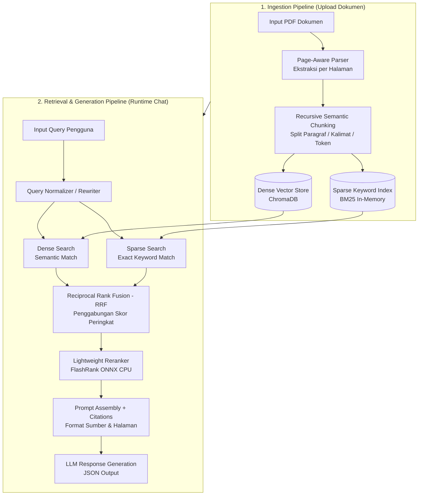

# Panduan Konsep RAG Standar Industri (Skala Minimum / Lean Modular RAG)

Dokumen ini berisi spesifikasi konsep dan arsitektur RAG (*Retrieval-Augmented Generation*) yang tepat guna untuk proyek `airesume-project`.

---

## 1. Latar Belakang & Masalah RAG Eksisting

| Komponen | Implementasi Eksisting ([backend/rag.py](../backend/rag.py)) | Masalah Utamanya |
| :--- | :--- | :--- |
| **Ingestion & Parsing** | `pypdf` digabung teksnya lalu dipotong kasar. | Metadata halaman & hierarki dokumen hilang. |
| **Chunking** | Slicing karakter kaku (`size=500, overlap=50`). | Kalimat & kata terpotong di tengah jalan. |
| **Indexing** | Single Dense Vector (ChromaDB default embedding). | Gagal mencari kata kunci eksplisit (nama, tanggal, nilai, skill). |
| **Retrieval** | Single Vector Query (`n_results=4`). | Sering mengambil dokumen bising (irrelevant top-k). |
| **Context & Prompt** | Gabung teks tanpa referensi lokasi halaman. | Jawaban sulit diverifikasi (tidak ada citation halaman). |

---

## 2. Arsitektur Proposed: Lean Modular RAG

Arsitektur RAG skala minimum dibagi menjadi 2 *subgraph* yang tersusun tegak lurus dari atas ke bawah:



---

## 3. Komponen Utama & Metode

### A. Ingestion & Chunking Berbasis Konteks
- **Preservasi Halaman**: Parsing PDF per halaman agar lokasi informasi tidak hilang.
- **Recursive Character Splitter**: Split teks dengan batas token ~256–512 token dan overlap 10-15%.
- **Struktur Metadata**:
  ```json
  {
    "source": "resume_ahmad.pdf",
    "page": 1,
    "chunk_id": "resume_ahmad.pdf-p1-c0"
  }
  ```

### B. Hybrid Search (Dense + Sparse / BM25)
- **Dense Vector Search**: Menangkap kemiripan makna/semantik kata.
- **Sparse Search (BM25)**: Menangkap kemiripan kata kunci eksplisit (sangat penting untuk resume: nama perusahaan, angka IPK, nama alat/teknologi).
- **Reciprocal Rank Fusion (RRF)**:
  $$RRF\_Score(d) = \frac{1}{k + rank_{dense}(d)} + \frac{1}{k + rank_{sparse}(d)} \quad (k=60)$$

### C. Re-ranking Ringan (FlashRank)
- **Cross-Encoder Reranking**: Menghitung relevansi aktual antara query dan kandidat chunk.
- **Efisiensi**: Menggunakan `flashrank` berbasis ONNX yang ringan di CPU tanpa GPU.

### D. Citation Grounding
- Menyusun konteks untuk prompt LLM dengan rincian sumber dan halaman:
  ```
  Konteks Dokumen:
  ---
  [Sumber: resume.pdf | Halaman: 2]
  Pengalaman di PT ABC sebagai Software Engineer...
  ---
  ```

---

## 4. Matriks Perbandingan Efisiensi

| Parameter | Naive RAG | Lean Modular RAG |
| :--- | :--- | :--- |
| **Pencarian Kata Kunci** | Rendah | Sangat Tinggi (BM25) |
| **Kuantitas Noise Context** | Tinggi | Sangat Rendah (Reranked) |
| **Akurasi Jawaban LLM** | Sedang (rawan halusinasi) | Tinggi (berbasis rujukan) |
| **Resource CPU/RAM** | Minimal | Tetap Minimal (Tanpa Service Tambahan) |
| **Tracing Sumber** | Nama File Saja | Nama File + Halaman |

---

## 5. Rencana Implementasi Bertahap

1. **Tahap 1: Ingestion & Splitter Refactoring**
   - Perbarui [backend/rag.py](../backend/rag.py) untuk ekstraksi PDF per halaman dan recursive chunking.
2. **Tahap 2: Integrasi BM25 & Hybrid Retrieval**
   - Pasang `rank_bm25` pada backend.
   - Buat memori index BM25 per `session_id`.
3. **Tahap 3: Re-ranking & Citations**
   - Pasang `flashrank` di backend.
   - Perbarui format rujukan pada sistem prompt LLM ([backend/prompts.py](../backend/prompts.py)).
