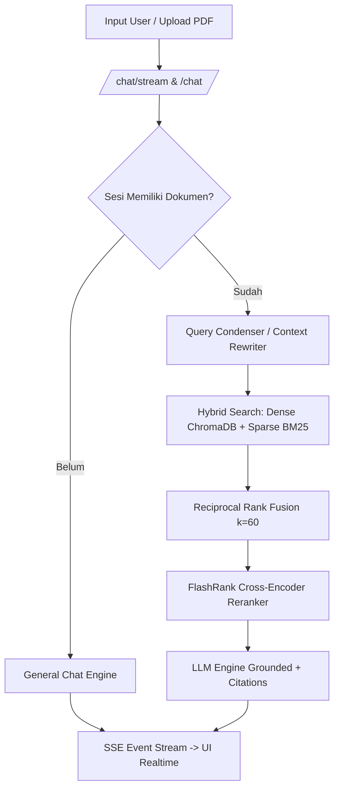

# Spesifikasi Arsitektur & Panduan Technical Stack RAG

Dokumen ini berisi dokumentasi terpadu untuk arsitektur RAG (*Retrieval-Augmented Generation*) pada `airesume-project`. Sistem ini mengimplementasikan **Unified Multi-Document Accumulation**, **Auto-RAG Detection**, **Hybrid Search (Dense + BM25)**, **FlashRank Re-ranking**, dan **SSE Real-Time Streaming**.

---

## 1. Alur Sistem & Skenario Penggunaan

Sistem ini tidak memisahkan antara chat biasa dan mode analisis dokumen. Semua interaksi berjalan melalui endpoint terpadu:

```mermaid
flowchart TD
    INPUT[Input User / Upload PDF] --> STREAM[/chat/stream & /chat/]
    STREAM --> CHECK{Sesi Memiliki Dokumen?}
    
    CHECK -- Belum --> GENERAL[General Chat Engine]
    CHECK -- Sudah --> CONDENSE[Query Condenser / Context Rewriter]
    
    CONDENSE --> HYBRID[Hybrid Search: Dense ChromaDB + Sparse BM25]
    HYBRID --> RRF[Reciprocal Rank Fusion k=60]
    RRF --> RERANK[FlashRank Cross-Encoder Reranker]
    RERANK --> LLM_RAG[LLM Engine Grounded + Citations]
    
    GENERAL --> SSE[SSE Event Stream -> UI Realtime]
    LLM_RAG --> SSE
```

---

## 2. Spesifikasi Teknis Komponen

### A. Ekstraksi PDF & Incremental Chunking
- **Parser**: `pypdf` (`PdfReader`) membaca PDF per halaman untuk mempertahankan metadata nomor halaman.
- **Chunking**: `_recursive_chunk` memotong teks secara hierarkis (karakter ideal ~400, overlap 60) berdasarkan separator `["\n\n", "\n", ". ", " ", ""]`.
- **Format Chunk ID**: `{filename}-p{page}-c{index}-{suffix}`.

### B. Incremental Multi-Doc Storage
- **Dense Store (ChromaDB)**: Koleksi `session-{session_id}` menyimpan vektor chunk dengan *cosine similarity*. Mengunggah dokumen baru akan menambahkan (*append*) data tanpa menghapus dokumen sebelumnya.
- **Sparse Store (BM25)**: `BM25Okapi` in-memory per sesi. Fungsi `_ensure_bm25_store` menjamin sinkronisasi otomatis dari ChromaDB jika terjadi backend restart.

### C. Multi-Turn Query Condensation
- Fungsi `should_condense_query` menganalisis pronomina (*"itu"*, *"ini"*, *"tersebut"*, *"dia"*, dll) atau pertanyaan singkat.
- `condense_query` merangkum riwayat chat + user input menjadi 1 query eksplisit sebelum dikirim ke RAG retrieval.

### D. Hybrid Search & Re-Ranking
- **Dense Vector**: `query_dense` mengambil top-10 kandidat dari ChromaDB.
- **Sparse Vector**: `query_bm25` mengambil top-10 kandidat dari BM25 index.
- **RRF Fusion**: `rrf_fusion` menggabungkan peringkat dengan skor:
  $$RRF(d) = \frac{1}{60 + rank_{dense}(d)} + \frac{1}{60 + rank_{sparse}(d)}$$
- **Reranker CPU**: `rerank_flashrank` menggunakan `flashrank` (`ms-marco-TinyBERT-L-2-v2`) via ONNX runtime untuk mengambil top-4 chunk paling relevan.

### E. Real-Time SSE Streaming
- Jawaban dikirim secara asynchronous menggunakan Server-Sent Events (SSE) via `/chat/stream`.
- Mengirim event `chunk` untuk teks jawaban dan event `documents` untuk sitasi dokumen & halaman rujukan.

---

## 3. Pemetaan Implementasi Codebase

| Komponen | Spesifikasi / Metode | Lokasi Kode |
| :--- | :--- | :--- |
| **PDF Extraction & Chunking** | `pypdf` + `_recursive_chunk` | [`backend/rag.py`](../backend/rag.py#L47-L90) & [`backend/main.py`](../backend/main.py#L137-L173) |
| **ChromaDB & BM25 Storage** | `PersistentClient` & `BM25Okapi` | [`backend/rag.py`](../backend/rag.py#L160-L209) |
| **Query Condenser** | Multi-turn rewriting | [`backend/main.py`](../backend/main.py#L80-L120) |
| **Hybrid Retrieval & RRF** | Dense + BM25 + RRF ($k=60$) | [`backend/rag.py`](../backend/rag.py#L213-L292) |
| **FlashRank Re-ranking** | `ms-marco-TinyBERT-L-2-v2` | [`backend/rag.py`](../backend/rag.py#L295-L350) |
| **SSE Stream Endpoint** | FastAPI `StreamingResponse` | [`backend/main.py`](../backend/main.py#L221-L308) |
| **Frontend Real-Time UI** | Astro + SSE EventSource | [`frontend/src/pages/index.astro`](../frontend/src/pages/index.astro) |
