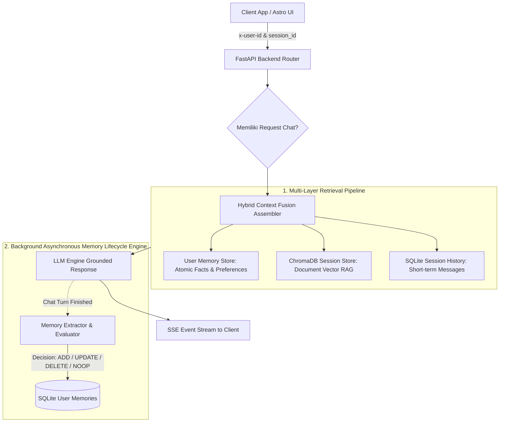

# Spesifikasi Arsitektur Identity & Long-Term Memory

Dokumen ini berisi spesifikasi arsitektur pengembangan sistem tingkat enterprise untuk `airesume-project`. Dokumentasi ini memperluas RAG berbasis sesi ([`RAG-architecture.md`](./RAG-architecture.md)) dengan menambahkan **Multi-Session User Identity (`user_id`)**, **Atomic Fact Memory Layer**, dan **Hybrid Context Fusion**.

---

## 1. Konsep Utama: User Identity & Cross-Session Personal Memory

Sistem membedakan secara tegas antara **Konteks Dokumen per Sesi** (*Vector RAG*) dan **Ingatan Profil Pengguna Lintas Sesi** (*Atomic Fact Store*):



---

## 2. Perbandingan Spesifikasi Arsitektur

| Komponen | Arsitektur Sesi Saat Ini (`RAG-architecture.md`) | Target Arsitektur Enterprise (`memory-architecture.md`) |
| :--- | :--- | :--- |
| **Identitas User** | Berbasis `session_id` terisolasi | `user_id` terautentikasi & terpusat |
| **Penyimpanan Profil** | Tidak ada | SQLite `user_memories` (Atomic Facts & Preferences) |
| **Manajemen Memori** | Hilang saat sesi baru dibuat | Persistent & Dynamic via LLM Lifecycle Engine |
| **Operasi Memori** | Append-only (dokumen PDF) | **ADD / UPDATE / DELETE / NOOP** (Konflik terselesaikan) |
| **Context Assembly** | Session Document + History | **User Facts + Session Document + History** |

---

## 3. Spesifikasi Teknis Komponen

### A. Skema Database Identity & Memori (`backend/sessions.py` & `backend/memory.py`)
```sql
-- Manajemen Pengguna & Sesi (SQLite)
CREATE TABLE IF NOT EXISTS users (
    id TEXT PRIMARY KEY,
    name TEXT,
    email TEXT,
    created_at TEXT NOT NULL
);

CREATE TABLE IF NOT EXISTS sessions (
    id TEXT PRIMARY KEY,
    user_id TEXT NOT NULL,
    title TEXT,
    created_at TEXT NOT NULL,
    FOREIGN KEY(user_id) REFERENCES users(id)
);

-- Store Memori Pengguna (Atomic Facts)
CREATE TABLE IF NOT EXISTS user_memories (
    id TEXT PRIMARY KEY,
    user_id TEXT NOT NULL,
    category TEXT NOT NULL,      -- 'profile', 'work', 'skill', 'preference'
    fact TEXT NOT NULL,          -- Contoh: 'Ahmad bekerja sebagai Software Engineer'
    created_at TEXT NOT NULL,
    updated_at TEXT NOT NULL,
    FOREIGN KEY(user_id) REFERENCES users(id)
);
```

### B. Background Memory Lifecycle Engine (Pattern Mem0)
Setelah respons dikirimkan ke pengguna, siklus *background worker* mengevaluasi interaksi percakapan untuk memperbarui ingatan pengguna menggunakan LLM dengan 4 opsi keputusan:
- **`ADD`**: Menambahkan fakta personal baru yang belum pernah tercatat.
- **`UPDATE`**: Memperbarui fakta yang mengalami perubahan (misal: perpindahan pekerjaan/domisili).
- **`DELETE`**: Menghapus fakta yang secara eksplisit tidak lagi berlaku.
- **`NOOP`**: Tidak melakukan tindakan jika fakta sudah tercatat atau bersifat obrolan umum.

### C. Hybrid Context Fusion (Assembler)
Prompt akhir yang dikirimkan ke model LLM disusun dengan urutan hierarki konteks berikut:
1. **System Instruction**: Karakter & aturan respon AI.
2. **User Personal Memory**: Daftar fakta aktif dari `user_memories` berbasis `user_id`.
3. **Session Document Context**: Top chunk relevan dari ChromaDB (jika sesi memiliki PDF).
4. **Short-Term Conversation History**: 6 pesan terakhir dari SQLite `messages`.
5. **User Query Terbaru**: Pertanyaan aktif pengguna.

---

## 4. Tahapan Implementasi (Roadmap Pembaruan)

1. **Phase 1: User Identity & Multi-Session Backend**
   * Tambahkan header `x-user-id` pada API FastAPI middleware.
   * Perbarui skema `sessions.py` untuk mengikat `session_id` ke `user_id`.

2. **Phase 2: Atomic Memory Lifecycle Engine**
   * Buat modul `backend/memory.py` dengan skema `user_memories`.
   * Implementasikan fungsi ekstraksi background async dengan evaluasi `ADD/UPDATE/DELETE/NOOP`.

3. **Phase 3: Hybrid Context Assembler**
   * Integrasikan pembacaan `user_memories` ke dalam pembentukan prompt di `/chat` & `/chat/stream`.

4. **Phase 4: Frontend Identity & Memory Management UI**
   * Tambahkan visualisasi profil fakta memori pengguna di frontend Astro agar user dapat melihat atau menghapus fakta memorinya.

---

## 5. Pemetaan Rencana Kode

| Komponen | Status Target | Lokasi File Rencana |
| :--- | :--- | :--- |
| **User & Session Store** | Perlu Ditingkatkan | [`backend/sessions.py`](../backend/sessions.py) |
| **Atomic Memory Engine** | Modul Baru | [`backend/memory.py`](../backend/memory.py) |
| **Unified Stream + Memory Router** | Perlu Ditingkatkan | [`backend/main.py`](../backend/main.py) |
| **Frontend Identity & Profile** | Component Baru | [`frontend/src/components/Sidebar.astro`](../frontend/src/components/Sidebar.astro) |
