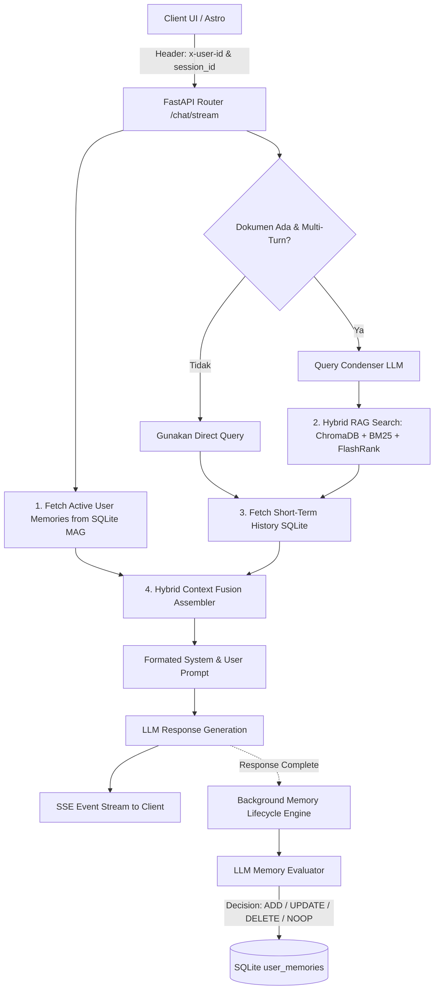

# Spesifikasi Arsitektur Identity, Personal Memory (MAG), & Hybrid Context Fusion

Dokumen ini memuat spesifikasi arsitektur komprehensif tingkat enterprise untuk sistem **Long-Term Personal Memory & Hybrid Context Fusion** pada `airesume-project`. Dokumen ini memperluas arsitektur RAG berbasis dokumen ([`RAG-architecture.md`](./RAG-architecture.md)) untuk membentuk sistem **Chatbot Berkemampuan Gemini / ChatGPT Versi Minimum**.

---

## 1. Analisis Komparatif: RAG vs CAG vs MAG

Dalam merancang memori chatbot cerdas, terdapat tiga paradigma utama pengelolaan konteks. Solusi enterprise yang kami terapkan mengombinasikan keunggulan ketiganya secara **Hybrid**.

```mermaid
quadrantChart
    title Matriks Kapabilitas Paradigma Konteks LLM
    x-axis Stabilitas Konteks Rendah --> Stabilitas Konteks Tinggi
    y-axis Skalabilitas Lintas Sesi Rendah --> Skalabilitas Lintas Sesi Tinggi
    quadrant-1 MAG (Atomic Fact Memory)
    quadrant-2 RAG (Vector Document Retrieval)
    quadrant-3 Non-Persistent Chat
    quadrant-4 CAG (Full Prompt Caching)
    RAG: [0.45, 0.70]
    CAG: [0.85, 0.25]
    MAG: [0.90, 0.95]
```

### A. RAG (Retrieval-Augmented Generation)
* **Mekanisme**: Memotong dokumen menjadi chunk, menyimpan vektor di ChromaDB & sparse index BM25, serta mengambil Top-K chunk terdekat secara real-time.
* **Keunggulan**: Sangat efisien untuk membaca dokumen eksternal pasif yang besar (seperti PDF buku, regulasi, resume).
* **Kelemahan Utama**:
  1. **Loss Lifecycle (Append-Only)**: Tidak memiliki fungsi pembaruan. RAG tidak dapat mendeteksi bahwa fakta baru membatalkan fakta lama.
  2. **Chunking Fragmentasi**: Fakta personal yang terpisah di batas chunk dapat hilang konteksnya.
  3. **Retrieval Overhead**: Membutuhkan pencarian vektor + BM25 + reranking untuk setiap query.

### B. CAG (Cache-Augmented Generation / Extended Context Window)
* **Mekanisme**: Memasukkan seluruh riwayat obrolan dan dokumen langsung ke *Context Window* raksasa LLM dengan memanfaat fitur *Prompt Caching* (KV Cache).
* **Keunggulan**: *Zero-retrieval loss*, LLM memahami hubungan antar paragraf secara komprehensif.
* **Kelemahan Utama**:
  1. **Non-Scalable Lintas Sesi**: Token membengkak drastis jika dimasukkan seluruh riwayat percakapan dari puluhan sesi sebelumnya.
  2. **Distraksi (*Lost in the Middle*)**: Terlalu banyak token tidak relevan menurunkan ketepatan instruksi utama LLM.
  3. **Biaya & Prefill Latency**: Invalidation cache saat ada pesan baru memicu pembengkakan token cost.

### C. MAG (Memory-Augmented Generation / Atomic Fact Store)
* **Mekanisme**: Mengelola layer memori terstruktur (tabel SQLite `user_memories`) yang berisi fakta atomik profil dan preferensi pengguna. Memori dipelihara oleh *Background LLM Lifecycle Engine* menggunakan aksi `ADD`, `UPDATE`, `DELETE`, dan `NOOP`.
* **Keunggulan**:
  1. **Stateful & Dynamic**: Bebas fakta usang, mendukung pembaharuan dan penghapusan fakta yang bertentangan.
  2. **Efisien Token**: Hanya fakta aktif yang ringkas disuntikkan ke prompt, tidak membebani context window.
* **Kelemahan Utama**:
  1. **Extra LLM Async Call**: Membutuhkan eksekusi LLM background setelah respons dikirimkan.
  2. **Intra-Turn Delay**: Fakta baru yang diucapkan pada prompt pertama baru aktif di database untuk turn percakapan berikutnya.

---

## 2. Arsitektur Hybrid Context Fusion

Sistem `airesume-project` menyatukan **MAG** (fakta pengguna), **RAG** (chunk dokumen PDF), dan **CAG** (history percakapan pendek) menjadi satu alur pemrosesan terpadu:



---

## 3. Spesifikasi Teknis Skema & Komponen

### A. Skema Database SQLite (`backend/sessions.py` & `backend/memory.py`)

```sql
-- Tabel Manajemen Pengguna
CREATE TABLE IF NOT EXISTS users (
    id TEXT PRIMARY KEY,
    name TEXT,
    email TEXT,
    created_at TEXT NOT NULL
);

-- Tabel Sesi Pengguna
CREATE TABLE IF NOT EXISTS sessions (
    id TEXT PRIMARY KEY,
    user_id TEXT NOT NULL DEFAULT 'default_user',
    title TEXT,
    created_at TEXT NOT NULL,
    FOREIGN KEY(user_id) REFERENCES users(id) ON DELETE CASCADE
);

-- Tabel Memori Pengguna (Atomic Facts / MAG)
CREATE TABLE IF NOT EXISTS user_memories (
    id TEXT PRIMARY KEY,
    user_id TEXT NOT NULL DEFAULT 'default_user',
    category TEXT NOT NULL,      -- 'profile', 'work', 'skill', 'preference'
    fact TEXT NOT NULL,          -- Contoh: 'Ahmad menguasai bahasa pemograman Python dan TypeScript'
    created_at TEXT NOT NULL,
    updated_at TEXT NOT NULL,
    FOREIGN KEY(user_id) REFERENCES users(id) ON DELETE CASCADE
);

-- Tabel Pesan Percakapan Sesi
CREATE TABLE IF NOT EXISTS messages (
    id INTEGER PRIMARY KEY AUTOINCREMENT,
    session_id TEXT NOT NULL,
    role TEXT NOT NULL,
    content TEXT NOT NULL,
    created_at TEXT NOT NULL,
    FOREIGN KEY(session_id) REFERENCES sessions(id) ON DELETE CASCADE
);
```

### B. Operasi Background Memory Lifecycle Engine

Setelah jawaban dikirimkan via SSE STREAM, `asyncio.create_task` mengevaluasi 2 pesan terakhir (User & Assistant) dengan prompt evaluator terstruktur yang mengembalikan keluaran JSON list aksi:

```json
[
  {
    "action": "ADD",
    "category": "skill",
    "fact": "Pengguna memiliki keahlian dalam membagikan arsitektur FastAPI."
  },
  {
    "action": "UPDATE",
    "target_id": "mem_123",
    "category": "work",
    "fact": "Pengguna saat ini bekerja sebagai Lead Engineer di Perusahaan X."
  },
  {
    "action": "DELETE",
    "target_id": "mem_099"
  },
  {
    "action": "NOOP"
  }
]
```

### C. Hierarki Prompt Assembly (Hybrid Context Fusion)

Prompt disusun secara linear dan terstruktur dalam order berikut:

1. **System Persona Instruction**: Aturan peran, bahasa Indonesia, format Markdown, dan restriksi tanpa dash.
2. **User Personal Memories (MAG Layer)**:
   ```text
   INGATAN PROFIL PENGGUNA (LONG-TERM MEMORY) :
   1. [profile] Ahmad adalah seorang Software Engineer.
   2. [skill] Menguasai Python, TypeScript, dan FastAPI.
   ```
3. **Session Document Context (RAG Layer)** (jika ada PDF terlampir):
   ```text
   KONTEKS DOKUMEN TERLAMPIR :
   ---
   [Chunk 1 - page 2] ...
   ---
   ```
4. **Short-Term Conversation History (CAG Layer)**: 6 pesan percakapan terakhir dalam sesi.
5. **User Query Aktif**: Pertanyaan terbaru dari pengguna.

---

## 4. Tahapan Roadmap Pembaruan Codebase

| Komponen | Deskripsi Tugas | Lokasi Kode |
| :--- | :--- | :--- |
| **User & Session Store** | Tambahkan `users` table dan `user_id` di `sessions` | [`backend/sessions.py`](../backend/sessions.py) |
| **Atomic Memory Engine** | Modul CRUD & Evaluator async background | [`backend/memory.py`](../backend/memory.py) |
| **Prompt Builder** | Integrasi `user_memories` ke system prompt | [`backend/prompts.py`](../backend/prompts.py) |
| **Unified Router API** | Middleware `x-user-id`, fusion prompt, SSE async memory task, REST API Memori | [`backend/main.py`](../backend/main.py) |
| **Frontend Profile Memory** | UI modal/drawer untuk menampilkan & menghapus fakta memori user | [`frontend/src/components/Sidebar.astro`](../frontend/src/components/Sidebar.astro) |
