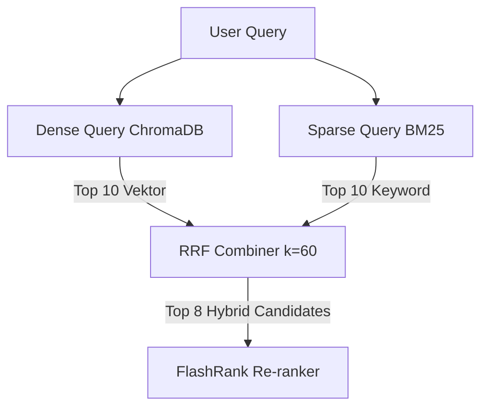

# Panduan Stack: Reciprocal Rank Fusion (RRF) Hybrid Search

Dokumen ini berisi panduan teknis penerapan algoritma **Reciprocal Rank Fusion (RRF)** untuk menggabungkan hasil pencarian *Dense Vector* (ChromaDB) dan *Sparse Keyword* (BM25) pada `airesume-project`.

---

## 1. Konsep & Formula RRF

RRF adalah metode penggabungan peringkat (*rank fusion*) bebas skala skor (*score-agnostic*). RRF tidak memedulikan perbedaan skala antara jarak kosinus ChromaDB dan skor nilai BM25, melainkan berfokus pada posisi urutan (*ranking*).

### Formula Matematis:
$$RRF\_Score(d) = \sum_{m \in M} \frac{1}{k + rank_m(d)}$$

Di mana:
- $M$: Kumpulan metode retrieval (`Dense` dan `BM25`).
- $r_m(d)$: Peringkat dokumen $d$ pada metode $m$ ($1, 2, 3, \dots$).
- $k$: Konstanta penyeimbang (*damping constant*), standar industri bernilai `60`.

---

## 2. Mengapa Memakai Nilai $k=60$?

Nilai $k=60$ mencegah dokumen berperingkat 1 dari salah satu metode terlalu mendominasi dokumen yang konsisten muncul di peringkat atas pada kedua metode.

Contoh perhitungan:
- Jika Dokumen A peringkat 1 di Dense ($1/(60+1) = 0.01639$) dan tidak muncul di BM25: Skor = `0.01639`.
- Jika Dokumen B peringkat 2 di Dense ($1/62 = 0.01612$) dan peringkat 2 di BM25 ($1/62 = 0.01612$): Skor = `0.03224`.
- **Hasil**: Dokumen B diprioritaskan karena relevan di kedua metode pencarian.

---

## 3. Implementasi Algoritma RRF di Python

```python
def reciprocal_rank_fusion(
    dense_results: list[dict],
    sparse_results: list[dict],
    k: int = 60,
    top_n: int = 8
) -> list[dict]:
    """
    dense_results: list of dict {'id': str, 'text': str, 'metadata': dict}
    sparse_results: list of dict {'id': str, 'text': str, 'metadata': dict}
    """
    rrf_scores: dict[str, float] = {}
    doc_lookup: dict[str, dict] = {}

    # 1. Proses Dense Search Results
    for rank, doc in enumerate(dense_results, start=1):
        doc_id = doc["id"]
        if doc_id not in doc_lookup:
            doc_lookup[doc_id] = doc
        rrf_scores[doc_id] = rrf_scores.get(doc_id, 0.0) + (1.0 / (k + rank))

    # 2. Proses Sparse (BM25) Search Results
    for rank, doc in enumerate(sparse_results, start=1):
        doc_id = doc["id"]
        if doc_id not in doc_lookup:
            doc_lookup[doc_id] = doc
        rrf_scores[doc_id] = rrf_scores.get(doc_id, 0.0) + (1.0 / (k + rank))

    # 3. Urutkan berdasarkan skor RRF tertinggi
    sorted_ids = sorted(rrf_scores.keys(), key=lambda x: rrf_scores[x], reverse=True)

    # 4. Susun daftar kandidat teratas
    fused_results = []
    for doc_id in sorted_ids[:top_n]:
        fused_item = dict(doc_lookup[doc_id])
        fused_item["rrf_score"] = rrf_scores[doc_id]
        fused_results.append(fused_item)

    return fused_results
```

---

## 4. Alur Integrasi dalam Retrieval Pipeline



---

## 5. Keunggulan RRF

1. **Bebas Normalisasi**: Tidak perlu normalisasi min-max skor yang rentan bias.
2. **Robust**: Tahan terhadap outlier skor tinggi semu.
3. **Komputasi Murah**: Berjalan dalam kompleksitas $O(N)$ di memori CPU.
