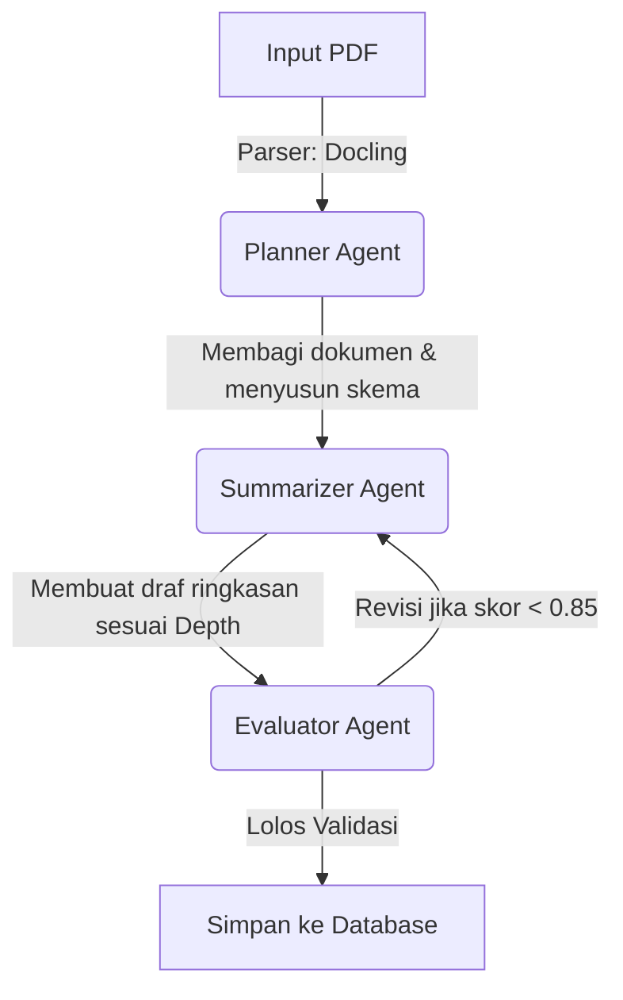

# Product Requirement Document (PRD)
## Resume Materi: Agentic AI-Driven Document Digest Engine

---

## 1. Project Overview
**Resume Materi** adalah platform portofolio teknis yang mendemonstrasikan sistem **Agentic AI** untuk ekstraksi, hierarkisasi, dan ringkasan dokumen secara asinkronus. Sistem ini membedah dokumen kompleks (PDF/Markdown) menjadi unit informasi semantik, menyusun ringkasan multi-level (Shallow, Medium, Deep), dan memvalidasi kebenaran hasil (*hallucination-free*) melalui *Self-Correction Loop* sebelum disajikan kepada pengguna.

---

## 2. Core Functional Specifications

### 2.1 Ingestion & High-Fidelity Parsing
*   **Input Support:** Berkas teks polos (.txt, .md) dan berkas PDF dinamis (multikolom, memiliki tabel, atau gambar).
*   **Layout-Aware Parser:** Sistem menghindari pemotongan teks mentah per karakter (*naive chunking*). Dokumen diparsing menggunakan pustaka pemrosesan tata letak (seperti **Docling** atau **MinerU**) untuk menghasilkan representasi Markdown terstruktur beserta koordinat elemennya.
*   **Semantic Chunking:** Hasil ekstraksi dikelompokkan secara logis berdasarkan sub-bab (*heading*) dan konteks semantik, bukan batas halaman fisik atau jumlah kata acak.

### 2.2 Dynamic Depth Summarization
Sistem memproduksi tiga tingkat kedalaman ringkasan dengan satu kali eksekusi agen atau secara dinamis sesuai pilihan pengguna:
*   **Shallow (Executive Summary):** 3-5 butir poin (*bullet points*) tingkat tinggi yang mencakup kesimpulan utama dokumen.
*   **Medium (Structured Digest):** Ringkasan terstruktur per sub-bab utama dengan penjelasan konteks singkat (maksimal 1-2 paragraf per sub-bab).
*   **Deep (Detailed Synthesis):** Analisis komprehensif per sub-bab yang menyertakan argumen pendukung, data teknis, metrik, atau rumus penting ($LaTeX$) tanpa kehilangan konteks mikro.

### 2.3 Context-Aware Theme Drill-Down
*   **Mekanisme Interaktif:** Saat membaca hasil ringkasan, pengguna dapat mengklik sub-bab atau tema tertentu yang menarik perhatian mereka.
*   **On-Demand Elaboration:** Daripada mengirimkan seluruh dokumen kembali ke LLM (yang memboroskan token), sistem akan mengambil potongan teks asli (*raw chunks*) yang relevan dari basis data, mengirimkannya ke LLM bersama instruksi spesifik, lalu menyajikan penjelasan mendalam langsung di antarmuka pengguna (*accordion/slide-over*).

---

## 3. Technical Architecture

### 3.1 Technology Stack
*   **Frontend UI:** Next.js (React) + TailwindCSS + Shadcn/ui (untuk rendering status progres agen).
*   **BFF (Backend-for-Frontend) Gateway:** Node.js / Next.js API Routes (menangani autentikasi, penyimpanan riwayat, dan penyajian data statis).
*   **AI Orchestration Engine:** FastAPI (Python) + LangGraph + Pydantic (menangani pipa parsing dokumen, koordinasi agen AI, dan penjaminan format luaran).
*   **Inference Tier:** **Gemini 1.5 Flash** (untuk pengerjaan agen tingkat dasar seperti Planner dan Summarizer) & **Gemini 1.5 Pro** / LLM alternatif sekelasnya (sebagai Reviewer/Critic Agent).
*   **Data & State Store:**
    *   **PostgreSQL:** Menyimpan dokumen asli, metadata, hasil ringkasan terstruktur, dan pemetaan segmen (*chunks*).
    *   **Redis:** Sebagai penengah antrean tugas asinkronus (*task queue*) dan penyimpanan status *state graph* LangGraph untuk *streaming* respons.

### 3.2 Agentic Workflow Design (LangGraph State Machine)
Proses pemisahan dokumen dan perangkuman dikelola sebagai mesin status (*state machine*) siklik dengan jalur umpan balik (*feedback loop*):



*   **Planner Agent:** Membaca daftar indeks/struktur semantik dokumen yang dihasilkan oleh parser. Ia menentukan bab-bab kunci mana saja yang harus dirangkum agar tidak terjadi redundansi.
*   **Summarizer Agent:** Mengambil potongan teks per bab dan menulis draf ringkasan sesuai kedalaman yang diminta (*depth_level*). Agen ini diinstruksikan menghasilkan keluaran berskema JSON kaku menggunakan fitur *Structured Outputs*.
*   **Evaluator Agent (Reviewer):** Melakukan pemeriksaan silang (*cross-examination*). Ia membandingkan hasil ringkasan terhadap teks asli menggunakan dua metrik:
    *   *Faithfulness:* Apakah ada klaim dalam ringkasan yang tidak ada di dokumen asli? (Pencegahan halusinasi).
    *   *Completeness:* Apakah ada poin krusial dari Planner yang terlewat?
    *   **Keputusan:** Jika skor evaluasi < 0.85, status dikembalikan ke Summarizer dengan catatan revisi spesifik.

---

## 4. Database Schema (Optimized for Drill-Down)

```sql
-- Menyimpan metadata dokumen utama
CREATE TABLE documents (
    id UUID PRIMARY KEY DEFAULT gen_random_uuid(),
    title VARCHAR(255) NOT NULL,
    total_words INT NOT NULL,
    created_at TIMESTAMP DEFAULT CURRENT_TIMESTAMP
);

-- Menyimpan potongan teks asli hasil parsing semantik (Kunci efisiensi Drill-Down)
CREATE TABLE document_chunks (
    id UUID PRIMARY KEY DEFAULT gen_random_uuid(),
    document_id UUID REFERENCES documents(id) ON DELETE CASCADE,
    chunk_index INT NOT NULL,
    heading_title VARCHAR(255), -- Nama bab/sub-bab asal teks ini
    raw_content TEXT NOT NULL,  -- Potongan teks asli
    word_count INT NOT NULL
);

-- Menyimpan hasil ringkasan utama yang sudah tervalidasi
CREATE TABLE resumes (
    id UUID PRIMARY KEY DEFAULT gen_random_uuid(),
    document_id UUID REFERENCES documents(id) ON DELETE CASCADE,
    depth_level VARCHAR(20) NOT NULL, -- 'shallow', 'medium', 'deep'
    structured_content JSONB NOT NULL, -- [{theme_title, summary_bullets}]
    faithfulness_score NUMERIC(3,2) NOT NULL,
    created_at TIMESTAMP DEFAULT CURRENT_TIMESTAMP
);
```

---

## 5. End-to-End User Experience (Asynchronous Loop)
1.  **Upload & Ingest:** Pengguna mengunggah dokumen dan memilih level kedalaman.
2.  **Immediate Acknowledgment:** Backend mengembalikan `task_id`. Pengguna tidak dibiarkan menunggu dalam halaman kosong.
3.  **Real-Time Progress Streaming:** Menggunakan SSE atau WebSocket, backend menyiarkan status agen:
    *   `STATUS: PARSING` -> "Mengekstrak teks dan tabel..."
    *   `STATUS: PLANNING` -> "Menganalisis struktur bab..."
    *   `STATUS: SUMMARIZING` -> "Menyusun poin penting bab 2 dari 5..."
    *   `STATUS: EVALUATING` -> "Memverifikasi kebenaran ringkasan..."
4.  **Interactive Exploration:** Ringkasan ditampilkan dalam Markdown. Klik pada tema memicu **Drill-Down**:
    *   Sistem mengambil `document_chunks` yang sesuai dari database.
    *   Hanya potongan teks kecil tersebut yang dikirim ke LLM untuk elaborasi mendalam instan.

---

## 6. Key Engineering Challenges Solved (Portfolio Highlights)
*   **Penyelesaian Limitasi Context Window:** Dengan memecah dokumen besar ke dalam skema `document_chunks`, sistem dapat memproses dokumen ratusan halaman tanpa menabrak batas token LLM, sekaligus menghemat biaya operasional API.
*   **Keandalan Format Keluaran (JSON Guardrails):** Memanfaatkan pustaka **Pydantic** di sisi Python untuk memastikan data yang masuk ke PostgreSQL selalu berupa struktur JSON bersih yang siap dirender oleh UI.
*   **Strategi Mitigasi Latensi Tinggi:** Mengubah proses penulisan ringkasan yang memakan waktu lama menjadi pengalaman interaktif melalui pendekatan asinkronus (*background jobs*) dan visualisasi pemikiran agen (*streaming agent states*).
